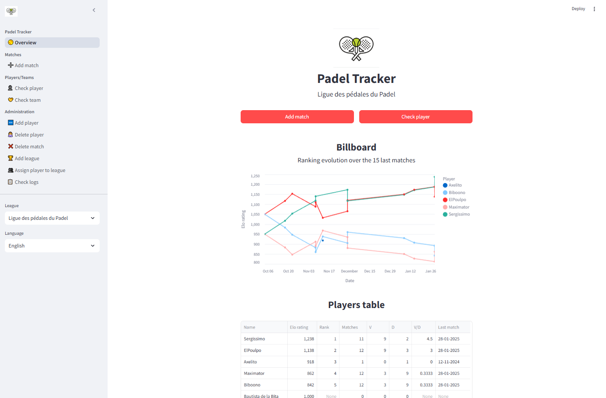
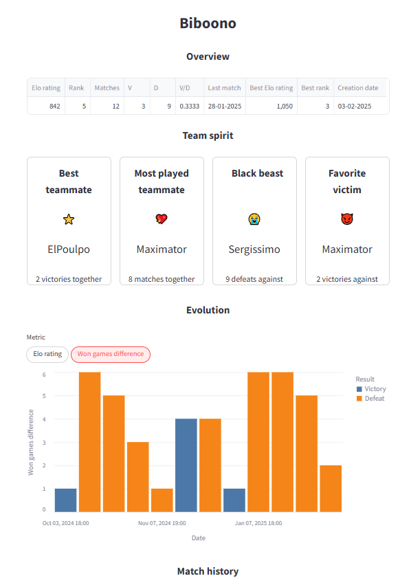
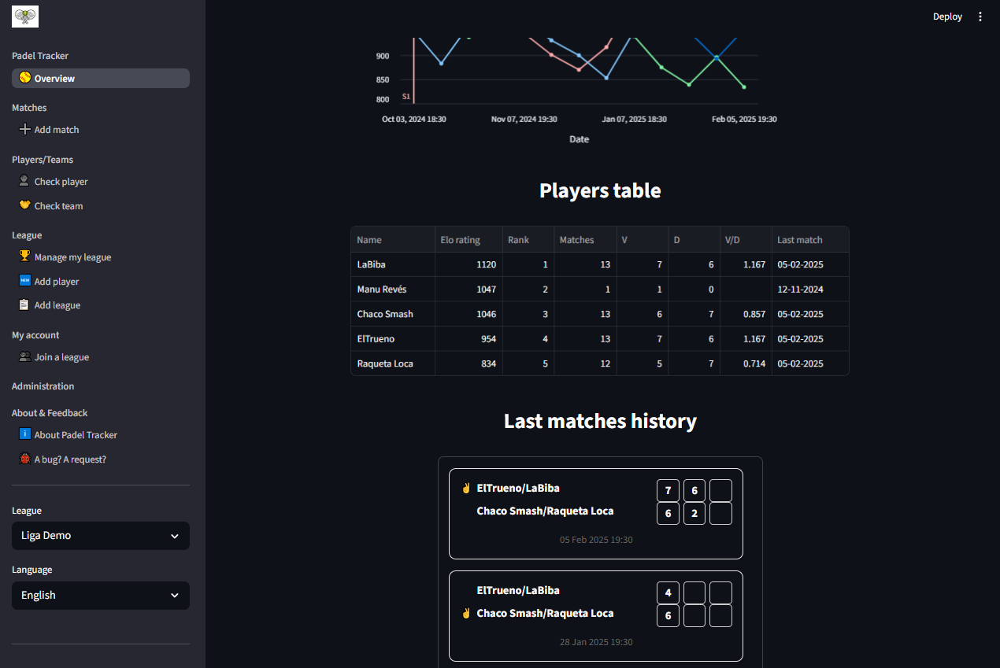
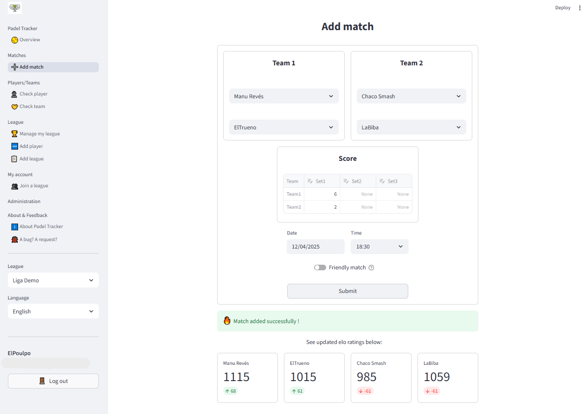

# Padel Tracker
[](https://github.com/poulpe/padel-tracker/releases)
[](https://github.com/psf/black)
[](https://github.com/astral-sh/ruff)
[](https://github.com/poulpe/padel-tracker/actions/workflows/tests.yml)
[](https://codecov.io/github/poulpe/padel-tracker)

Small app to keep track of Padel matches

## Overview
Padel Tracker is a small app to keep track of Padel matches and allow analysis of the progresses of a group of friends over time.  
It provides player rankings using an Elo-based system and maintains a history of matches, teams and individual performances.

The application is hosted on **Streamlit Community Cloud** and can be used on web browser or mobile   
➡ **https://poulpe-padel-tracker.streamlit.app**
      


## Features
- **Player and Team Management**: Add, update, and check players and teams statistics.
- **Match History**: Record match results (date, teams, scores)
- **Elo Ranking System**: Calculate player rankings dynamically based on match results with a bonus system vs won games difference. Every single point counts !
- **League Management**: Ability to group players within a league, to follow/compare only your mates (player can also belong to several leagues)
- **Data Persistence**: Via database hosted on the provider of your choice. Can also be used in `local` mode to avoid any need of hosting database online.
- **Interactive UI**: Built with Streamlit, providing an intuitive and responsive interface in a web browser.
- **Visualization**: Charts and tables for ranking history and match statistics.
- **Multilingual Support**: English, French and Español
- **User management**: User authentification using OpenID Connect (OIDC) providers. OIDC is supported by Streamlit from `v1.42`.

## Technologies used
- **Backend**: [SQLModel](https://github.com/tiangolo/sqlmodel) (SQLAlchemy + Pydantic)
- **Frontend**: [Streamlit](https://streamlit.io/) with modular pages and navigation
- **Database**: PostgreSQL (Hosted on [Supabase](https://supabase.com/) for this case)
- **Database migrations**: Managed with [Alembic](https://alembic.sqlalchemy.org/)
- **User authentification**: Through the OpenID Connect (OIDC) provider [Auth0](http://www.auth0.com), supporting email/password and Google accounts.
- **Tests** : [Pytest](https://docs.pytest.org/en/stable/) and dedicated test framework from Streamlit

## Gallery

|  |  |  |
|------------------------------------------------------------------------------------|--------------------------------------------------------------------------------|--------------------------------------------------------------------------------|

## Roadmap / Ideas
- Loggings
  - [x] Overall stuff
- UI
  - [x] Basic Streamlit tuto
  - [x] General layout
  - [x] Graphs
  - [x] Export data as .csv : via the Streamlit builtin feature
- Users
  - [x] Manage users (authentification, access...)
  - [x] User auth / login/logout in UI
- Database
  - [x] Deletes
  - [x] Migrations
  - [x] Get 'data' online
- Analytics
  - [x] Best teammate
  - [x] Best rival
  - [x] nb_games per Match
  - [x] Other stats (V/D ratio)
    - [x] Like select player, it shows these analytics
- Leagues
  - [x] Allow several league
  - [x] League description ?
  - [x] Manage league ? (i.e: league admin to add/remove players, rename league)
- Tests
  - [x] Basic tests on models
  - [x] Basic tests on services
  - [ ] UI tests
- Feedback
  - [x] "Report bug" form

---
# Some specifities

## Run locally and reproduce this app
### .env
To run the application locally, you need to set up environment variables in a .env file for secret management. 
Below is the required structure:
```text
# Run parameters
db_mode=local # "local" or "cloud"
run_mode=test # "debug", test" or "prod"
log_level_console=INFO

# Cloud database related (not needed if you just run locally)
db_url_cloud_debug=my_debug_db_url
db_url_cloud_test=my_test_db_url
db_url_cloud_prod=my_prod_db_url
```
If you set `db_mode` to `local`, it will just create/read/update a local database in `data/` folder, so you don't need to have a database if you want to only do locally.

The used database location depends on `db_mode` and `run_mode`, as defined as below :

| **db_mode** | **run_mode** | **db_url**                     |
|-------------|--------------|--------------------------------|
| local       | debug        | `data/database_debug.db`       |
| local       | test         | `tests/data/database_tests.db` |
| local       | prod         | `data/database.db`             |
| cloud       | debug        | `db_url_cloud_debug` from env  | 
| cloud       | test         | `db_url_cloud_test` from env   | 
| cloud       | prod         | `db_url_cloud_prod` from env   | 

Note: secret management for the streamlit hosted app is done via the dedicated
[streamlit secret management method](https://docs.streamlit.io/develop/concepts/connections/secrets-management).  
The app is looking in priority if any `.env` file is defined,
otherwise it falls back to checking if a `.streamlit/secrets.toml` file is there.

### Run locally
1) Clone the repository
2) Make sure ``uv`` is installed on your setup
3) In a terminal, go to folder and run the project via typing this command:  
(it will install project automatically if not already installed)
```shell
uv run padel-tracker
```

Note: this actually runs the following command inside a venv:  
```streamlit run src/padel-tracker/ui/streamlit_app.py```

## Database
### Migrations

Database migration = models changed, how to reflect it on current database "automatically"  
Migrations has been configured with `Alembic`

#### Use cases
0) Init 
```shell
alembic revision --autogenerate -m "first revision"
alembic upgrade head
```

1) Anything has been changed to models
```shell
alembic revision --autogenerate -m "added new_field to Player"
alembic upgrade head
```

---
© 2025 Padel Tracker
